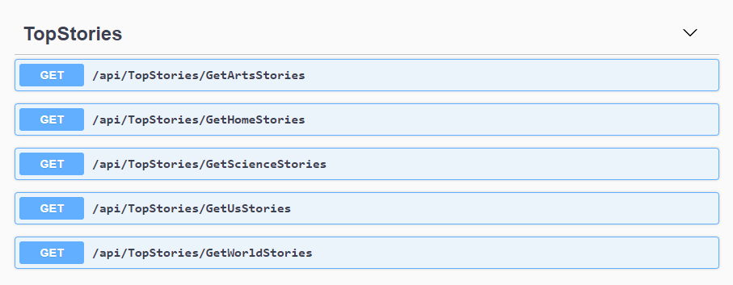

# Top Stories API

API to mimic [NYT Top Stories API](https://developer.nytimes.com/docs/top-stories-product/1/overview)

- **.Net Core** (3.x)
- **SQL Server** (2019)

## Installation

1. Clone/download repo
2. Create a database named `NYTStories`
3. Use the `top-stories-db-backup.sql` script to create the tables
4. Open the `TopStoriesAPI.sln` file on VSCode or VS
5. Run the project and go to `https://localhost:44392/api/index.html`

## API Endpoints

